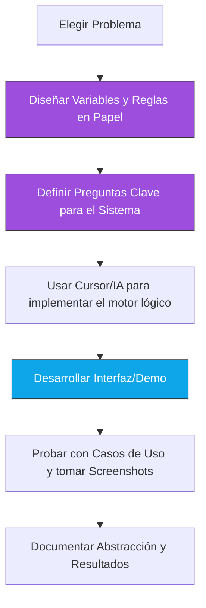

# Proyecto: Sistemas de Razonamiento Lógico

El objetivo de este proyecto es aplicar los conceptos de **Lógica Proposicional**, **Bases de Conocimiento (KB)** y **Satisfacibilidad (SAT)** para diseñar un sistema capaz de razonar sobre un problema del mundo real.

:::project{id="p3-logica" title="Sistemas de Razonamiento Lógico" due="2026-02-09" team_size="1-2" points="10"}

**Misión:** Diseñar la "inteligencia" de un sistema que, a partir de hechos y reglas, pueda inferir estados ocultos, detectar contradicciones o resolver conflictos logísticos.

> **¡Ayuda disponible!** Tienes a tu disposición un [esqueleto de código](./code/logic_skeleton.py) para acelerar tu desarrollo.

:::

---

## El Enfoque: Diseño antes que Código

En la era de los LLMs (como ChatGPT o Cursor), programar es fácil. Lo difícil es **diseñar el sistema**. Este proyecto se evalúa principalmente por tu capacidad de abstracción:

1.  **Modelar el Mundo:** ¿Cómo conviertes la realidad en variables $P, Q, R$?
2.  **Definir las Reglas:** ¿Cómo escribes las "leyes" del sistema como fórmulas lógicas?
3.  **Hacer Preguntas:** ¿Qué le preguntarás a tu sistema para demostrar que "piensa"?

---

## Opciones de Proyecto

Puedes elegir uno de los siguientes temas o proponer uno propio (siempre que cumpla con los requisitos mínimos).

### Opción A: El Oráculo Social (Psicología y Señales)
Diseña un motor que analice interacciones sociales para inferir estados como: "¿Le gusto?", "¿Está enojado?", o "¿Me está mintiendo?".

*   **Hechos Observables:** `tarda_mas_de_1_hora_en_responder`, `deja_en_visto`, `menciona_a_otros_amigos`.
*   **Estado Oculto:** `interes_romantico`, `molestia`, `timidez`.
*   **Meta:** El sistema debe decirte si, dada la conducta observada, la conclusión es **necesariamente cierta** o si hay **señales contradictorias**.

### Opción B: Auditor de Seguridad (Hackeo Lógico)
Diseña las reglas de una casa inteligente o un sistema de acceso y usa un SAT Solver para encontrar "backdoors" o fallos de seguridad.

*   **Reglas:** "Si el dueño está fuera, la alarma debe estar armada". "Si la alarma está armada, la puerta debe estar cerrada".
*   **Vulnerabilidad:** Encuentra si existe una combinación de valores (modelo) donde las reglas se cumplen pero una condición de seguridad se rompe (ej. `puerta_abierta` y `alarma_armada`).

### Opción C: Arquitecto de Eventos (Logística de Caos)
Resuelve el conflicto de horarios de un festival de música o un congreso donde hay recursos limitados y deseos en conflicto.

*   **Restricciones:** "Banda A y Banda B no pueden tocar al mismo tiempo". "El escenario principal solo tiene 3 turnos".
*   **Deseos:** "El usuario quiere ver a la Banda A y a la Banda C".
*   **Meta:** El sistema debe generar un itinerario **satisfacible** o demostrar que es **imposible** cumplir todos los deseos.

---

## Requisitos Mínimos

Para que tu proyecto sea válido, debe incluir:

1.  **Diccionario de Variables:** Una lista clara de qué significa cada literal proposicional.
2.  **Base de Conocimiento (KB):** Al menos **10 reglas lógicas** (implicaciones, bicondicionales, disyunciones) que definan el funcionamiento del sistema.
3.  **Motor de Inferencia/SAT:**
    *   Debe poder recibir una consulta (`ASK`).
    *   Debe poder determinar si una sentencia es **Entailed** ($\models$) o si un conjunto de sentencias es **Satisfacible**.
4.  **Demo Funcional:** El sistema debe tener una interfaz o script que permita interactuar con él (puedes usar **Streamlit**, JavaScript/HTML, una CLI robusta en Python, etc.). Consulta el [código base](./code/logic_skeleton.py) para ver un ejemplo de integración con Streamlit.
5.  **Casos de Prueba:** Al menos 3 escenarios diferentes (ej. "Caso donde todo es consistente", "Caso donde hay contradicción", "Caso donde la respuesta es incierta").

---

## Proceso de Desarrollo Sugerido

---

## Evaluación

> **Nota Crítica:** El código funcional y la documentación completa en GitHub son **requisitos obligatorios**. Si el proyecto no corre o no tiene documentación, la calificación es 0, independientemente del diseño.

| Criterio | Peso | Qué se evalúa |
| :--- | :---: | :--- |
| **Abstracción** | 35% | Claridad y completitud del diccionario de variables. ¿El modelo captura la esencia del problema? |
| **Diseño de KB** | 35% | Calidad y rigor de las reglas lógicas. Uso correcto de conectivos y ausencia de redundancias triviales. |
| **Resolución y Demo** | 30% | El sistema infiere correctamente. La demo (Streamlit, CLI, etc.) es intuitiva y muestra casos de éxito y fallo. |
| **Código y Docs** | **MANDATORIO** | El código debe estar limpio, en GitHub, con un README profesional y screenshots. Sin esto, no hay calificación. |

---

## Guía de Documentación Detallada (E2E)

Para asegurar la máxima puntuación, tu `README.md` en GitHub debe seguir esta estructura detallada:

### 1. Definición del Problema
Describe brevemente qué estás resolviendo y por qué la lógica proposicional es adecuada para este caso.

### 2. Diccionario de Variables
Presenta una tabla con tus variables proposicionales.
*   **Mal:** `P` = "Está feliz".
*   **Bien:** `persona_esta_feliz`: Verdadero si el sujeto muestra signos de alegría tras la interacción.

### 3. Especificación de la Base de Conocimiento (KB)
Este es el corazón del proyecto. Documenta cada regla en tres niveles:
1.  **Lenguaje Natural:** "Si me ignora en WhatsApp pero publica historias, entonces está enojado".
2.  **Lógica Formal:** $(\text{ignora\_wa} \land \text{publica\_historia}) \rightarrow \text{esta\_enojado}$.
3.  **Justificación:** ¿Por qué esta regla tiene sentido en tu modelo?

### 4. Implementación del Motor Lógico
Explica brevemente qué herramienta o librería usaste (ej. `pysat`, `sympy`, o tu propio algoritmo de resolución) y cómo transformas la entrada del usuario en consultas lógicas.

### 5. Guía de Uso y Demo
*   **Instrucciones de Instalación:** Pasos claros para correr tu código localmente.
*   **Screenshots de Casos de Uso:**
    *   **Caso A (Consistente):** Hechos que llevan a una conclusión clara.
    *   **Caso B (Inconsistente):** Hechos que causan una contradicción en la KB.
    *   **Caso C (Incierto):** Hechos que no son suficientes para asegurar una conclusión (ASK retorna "Unknown").

---

## Entrega

1.  **Nuevo Repositorio:** Debes crear un **repositorio de GitHub completamente nuevo y separado** de este curso para tu proyecto. No subas tu código al repositorio de la clase.
2.  El repositorio debe tener un `README.md` profesional que siga la [Guía de Documentación](#guía-de-documentación-detallada-e2e).
3.  **Link en Canvas:** Entrega el **link de tu nuevo repositorio de GitHub** en la tarea correspondiente. Sin link de GitHub (externo) no hay calificación.
4.  **Importante:** Asegúrate de que el repositorio sea público o invites al profesor como colaborador.

---

## Esqueleto de Código

Para ayudarte a comenzar, hemos preparado un [esqueleto de código](./code/logic_skeleton.py) que define la estructura básica de una Base de Conocimiento y cómo podrías integrar un motor de inferencia. Úsalo como base para construir tu lógica.

:::exercise{title="¿Libertad Creativa?" difficulty="1"}
¿Quieres hacer algo diferente? ¡Adelante! Siempre que uses **lógica proposicional** y un **motor de inferencia/SAT** para resolver un problema de decisión o diagnóstico, tu proyecto es válido.
:::
